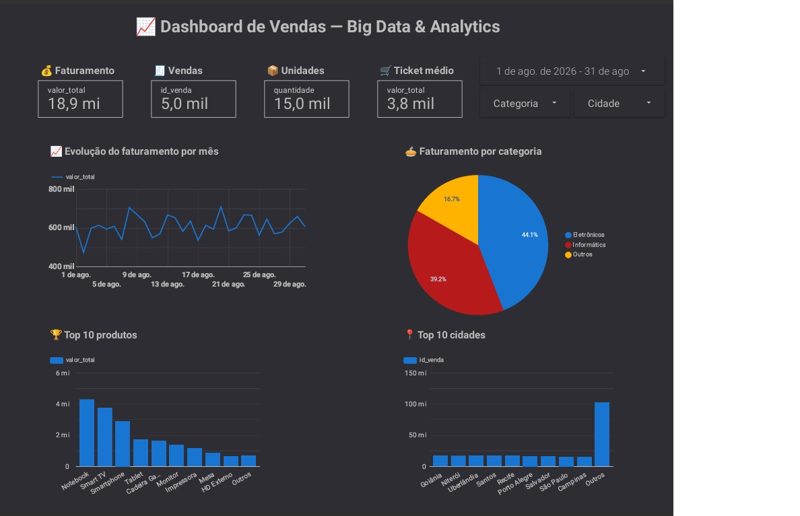

# 📊 Projeto Big Data & Analytics — Dashboard de Vendas

## 📌 Sobre o projeto

Projeto prático desenvolvido para aplicar conceitos de **Big Data, Cloud Computing, SQL, análise de dados e Business Intelligence** utilizando serviços do Google Cloud.

O projeto utiliza uma base com **100.000 registros de vendas**, armazenada e analisada no **Google BigQuery**, e utiliza o **Looker Studio** para transformar os dados em um dashboard interativo.

O objetivo é demonstrar, de forma prática, um fluxo de análise de dados próximo ao utilizado em projetos reais:

**Dados → BigQuery → SQL → Análise → Looker Studio → Dashboard Interativo**

---

## 🎯 Objetivos

- Praticar conceitos de Big Data em ambiente de nuvem.
- Trabalhar com dados utilizando o Google BigQuery.
- Realizar consultas e agregações utilizando SQL.
- Analisar indicadores comerciais.
- Desenvolver visualizações de dados.
- Criar um dashboard interativo.
- Trabalhar com filtros e segmentação de dados.
- Desenvolver experiência prática para portfólio profissional.

---

## ☁️ Tecnologias utilizadas

- **Google Cloud Platform (GCP)**
- **Google BigQuery**
- **SQL**
- **Looker Studio**
- **GitHub**

---

## 🗃️ Base de dados

A base utilizada contém **100.000 registros de vendas**.

Principais campos utilizados durante as análises:

| Campo | Descrição |
|---|---|
| `data_venda` | Data da venda |
| `produto` | Produto vendido |
| `categoria` | Categoria do produto |
| `cidade` | Cidade relacionada à venda |
| `valor_total` | Valor total da venda |

---

## 📈 Principais indicadores

O dashboard apresenta quatro KPIs principais:

| Indicador | Resultado |
|---|---:|
| 💰 Faturamento total | **R$ 374.743.813,29** |
| 🧾 Total de vendas | **100.000** |
| 📦 Unidades vendidas | **300.418** |
| 🛒 Ticket médio | **R$ 3.747,44** |

---

## 📊 Visualizações

### 📈 Evolução do faturamento

Série temporal com o faturamento agrupado por **mês**, permitindo analisar a evolução das vendas ao longo do período disponível na base.

### 🥧 Faturamento por categoria

Visualização da distribuição do faturamento entre as diferentes categorias de produtos.

### 🏆 Top 10 produtos

Ranking dos dez produtos com maior faturamento, permitindo identificar os produtos de maior impacto financeiro.

### 📍 Top 10 cidades

Ranking das dez cidades com maior faturamento, possibilitando uma análise da distribuição geográfica das vendas.

---

## 🔎 Filtros interativos

O dashboard possui filtros que permitem realizar análises personalizadas:

- 📅 **Período**
- 🏷️ **Categoria**
- 📍 **Cidade**

Os filtros permitem alterar dinamicamente os KPIs e as visualizações apresentadas no dashboard.

---

## 🧠 Conceitos praticados

Durante o desenvolvimento do projeto foram praticados conceitos relacionados a:

- Big Data
- Cloud Computing
- Data Warehouse
- SQL
- Agregação de dados
- Análise de dados
- KPIs
- Business Intelligence
- Data Visualization
- Dashboards interativos
- Filtros e segmentação de dados

---

## 🏗️ Arquitetura do projeto

```text
                     BASE DE VENDAS
                           │
                           ▼
                  ┌─────────────────┐
                  │  Google Cloud   │
                  │    BigQuery     │
                  └────────┬────────┘
                           │
                           │ SQL / Consultas
                           ▼
                  ┌─────────────────┐
                  │    Análise      │
                  │    dos dados    │
                  └────────┬────────┘
                           │
                           ▼
                  ┌─────────────────┐
                  │  Looker Studio  │
                  │    Dashboard    │
                  └────────┬────────┘
                           │
                           ▼
                  ANÁLISE INTERATIVA
```

---

## 🔄 Fluxo de desenvolvimento

O projeto foi desenvolvido seguindo as seguintes etapas:

### 1. Preparação dos dados

Utilização de uma base contendo 100.000 registros de vendas.

### 2. Armazenamento no Google BigQuery

Os dados foram trabalhados dentro do ambiente de **Data Warehouse do Google Cloud**, utilizando o BigQuery.

### 3. Consultas SQL

Foram realizadas consultas para obter indicadores, agregações e rankings necessários para a análise.

### 4. Construção dos indicadores

Foram calculados indicadores como:

- Faturamento total;
- Quantidade de vendas;
- Quantidade de unidades vendidas;
- Ticket médio.

### 5. Construção do dashboard

Os dados foram conectados ao **Looker Studio** para criação das visualizações.

### 6. Interatividade

Foram adicionados filtros de:

- período;
- categoria;
- cidade.

### 7. Análise

O dashboard permite explorar os dados de maneira interativa e identificar padrões de desempenho comercial.

---

## 🚀 Resultado

O resultado é um **dashboard comercial interativo** capaz de apresentar indicadores de vendas e permitir a exploração dos dados por período, categoria e cidade.

O projeto foi desenvolvido com foco em **experiência prática e portfólio profissional**, demonstrando contato com ferramentas e conceitos relacionados às áreas de:

**Big Data + Cloud Computing + SQL + Data Analytics + Business Intelligence**

---

## 📸 Dashboard



Exemplo:

```text
📊 Dashboard de Vendas
├── 💰 Faturamento
├── 🧾 Total de vendas
├── 📦 Unidades vendidas
├── 🛒 Ticket médio
├── 📈 Evolução mensal
├── 🥧 Faturamento por categoria
├── 🏆 Top 10 produtos
└── 📍 Top 10 cidades
```

---

## 🔮 Próximos passos

Como evolução do projeto, podem ser implementadas novas funcionalidades, como:

- Automatização da ingestão de novos dados;
- Criação de pipelines de dados;
- Desenvolvimento de transformações adicionais utilizando SQL;
- Análise de crescimento entre períodos;
- Comparação entre períodos;
- Criação de métricas de margem e rentabilidade;
- Integração com novas fontes de dados;
- Evolução para uma arquitetura de dados mais próxima de um ambiente produtivo.

---

## 📚 Aprendizados

Este projeto proporcionou experiência prática com um fluxo completo de análise de dados em nuvem, desde o armazenamento e consulta dos dados até a construção de indicadores e visualizações.

Entre os principais aprendizados estão:

- utilização do **Google BigQuery** como ambiente de análise de dados;
- utilização de **SQL** para consultas e agregações;
- criação e interpretação de **KPIs**;
- construção de **dashboards interativos**;
- utilização de filtros para exploração dos dados;
- organização de informações para tomada de decisão;
- utilização de ferramentas de **Cloud e Analytics**.

---

## 👨‍💻 Autor

**João Pedro Orlando**

Projeto desenvolvido como prática de **Big Data, Cloud Computing, SQL e Data Analytics**.

---
